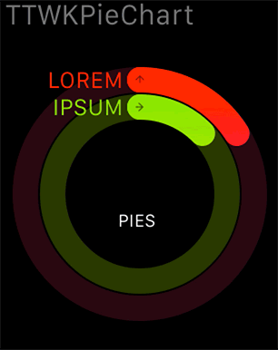

# TTWKPieChart

A component that simplifies creating of animated Apple Watch style pie charts similar to the ones used within the Activity app.

## Quick Start

To use with your WatchKit extension:

 - add a WKInterfaceImage into your storyboard exactly where you want the chart to appear (you can use a WKInterfaceGroup as well);

 - make sure its Mode is set to 'Center' and Width and Height to 'Size To Fit Content';
 
 - connect the image or a group with a corresponding property in your subclass of WKInterfaceController;
 
 - import TTWKPieChart.h;
 
 - create and configure a pie chart within your awakeWithContext: method, for example:

        // Create and configure the chart generator
        TTWKPieChart *pieChart = [[TTWKPieChart alloc] init];
        pieChart.radius = floorf([WKInterfaceDevice currentDevice].screenBounds.size.width * 0.45);
        pieChart.bandWidth = 14;
        // ...

        TTWKPieChartBand *band1 = [[TTWKPieChartBand alloc] init];
        band1.icon = [UIImage imageNamed:@"test-icon-1"];
        band1.caption = @"LOREM";
        band1.startColor = [UIColor colorWithRed:1.0000 green:0.0941 blue:0.0392 alpha:1.0];
        band1.endColor = [UIColor colorWithRed:1.0000 green:0.0275 blue:0.6392 alpha:1.0];
        band1.backgroundColor = [UIColor colorWithRed:0.1608 green:0.0314 blue:0.0667 alpha:1.0];
        band1.value = 0.86;
        // ...

        // Configure the text to display
        pieChart.largeText = [[NSAttributedString alloc]  initWithString:@"125"
        //...
        
        // Generate the animated image at 15 FPS, send it off to the device and begin animation
        _image = [pieChart animatedImageWithFrameRate:15];
        [self.chartImage setImage:_image];
        [self.chartImage startAnimatingWithImagesInRange:NSMakeRange(0, _image.images.count) duration:_image.duration repeatCount:1];

Please see the example project for a complete example.

## Installation

TTWKPieChart is available through [CocoaPods](http://cocoapods.org). To install
it, simply add the following line to your Podfile:

    pod "TTWKPieChart"

Alternatively, you can simply drop in the classes from `Pod/Classes` into your project.

## Author & License

TTWKPieChart is created by [TouchTribe B.V.](http://www.touchtribe.nl) and is available under the MIT license. See the LICENSE file for more info.
